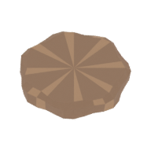
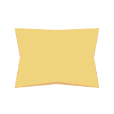
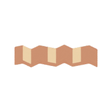

# Midnight Burger Bot

- **Author**: Yuchen Zhou
- **Description**: It's midnight. Every human cook has gone home. The only one still on shift is you, a little bot bolted to a three-joint robot arm behind a very counter. Orders keep sliding in on the wall screen, the ingredient bins keep rolling past, and nobody told you what a "burger" is supposed to look like. Stack the layers in order to make a nice one. Get one wrong and the whole thing hits the bin. **Come on! Someone are hungry.**


# Asset Pipeline
## Assets
Every mesh in this game was modeled in Blender. The ten ingredients:

| | | | | |
|---|---|---|---|---|
|  |  |  |  |  |
| Bottom Bun | Patty | Lettuce | Cheese | Top Bun |
|  |  |  |  |  |
| Tomato | Onion | Pickle | Bacon | Sauce |

Plus the bot, the three-joint arm and its fingers, six ingredient bins, the conveyor and its tunnel housings, the assembly plate, the discard bin, the counter, the service bell and the wall-mounted order board.

## How it works
The editable source is [`scenes/burger.blend`](scenes/burger.blend) . There is only one scene, flat vertex colors, no textures. Running `make` from `scenes/` invokes the project's Blender exporters to produce two files: [`dist/burger.pnct`](dist/burger.pnct) holds the packed position/normal/color/texcoord vertex data for every mesh, and [`dist/burger.scene`](dist/burger.scene) holds the transform hierarchy, mesh instances and the camera. At startup `PlayMode` loads both, then looks up the named transforms it needs . Arm joints, bins, plate are animated at runtime. The arm's reach, the bin slots and the discard bin are all positioned from code, so the layout can be tuned without reopening Blender.

The order-board icons are a second, smaller pipeline: [`scenes/export-icons.py`](scenes/export-icons.py) renders each of the ten ingredient models to a transparent 192×192 PNG in `dist/icons`, from a shared camera angle and light rig so the icon reads as the same object you see sitting in the bin. `make -C scenes icons` regenerates them; the game loads them once at startup and draws them as textured quads on the board.

Both generated asset sets are checked into `dist/`, so **building and running the game does not require Blender**. `python3 scenes/validate-burger.py` checks the exported scene for correct names, colors, hierarchy, work-envelope distances, ingredient alignment, triangle budget, camera count and chunk structure.

# How To Play:

1. You are the bot. The wall board shows your order as a row of ingredient icons from left to right. I am sure robot does not need a glass for that.
2. Six bins sit on the conveyor in front of you. Press **1–6** to pick a slot and the arm swings over it. Press **Enter** and the gripper drops, closes, lifts, carries the ingredient to the plate and lets it go. There are no bin labels, you must identify ingredients by looking at them, like a chief.
3. **Order matters.** A correct layer lands on the stack. A **wrong layer ruins the entire burger** and you start the same recipe over from an empty plate, minus **5 seconds** off the clock. No mercy from your boss. Oh btw, he is a bot too.
4. After every pick the conveyor shuffles: the bins you used slide off to the left and fresh supplies roll in from the right. The good news. The ingredient you need next is always somewhere in the six. The bad news is you still have to find it.
5. Two orders are shown at once: the one you're building on the left, the one waiting on the right. Press **Tab** to swap them, but only **before your first grab**. Once the gripper closes on layer one, you're committed. Finish an order and you score **twice its layer count**; orders run from 3 to 10 layers, and ingredients can repeat.
6. You get **180 seconds**, animation time included. The board shows your final score once it is end.
7. Want another shift? Press **R** for a fresh 180 seconds. **Escape** clocks you out.

## Controls
- **1–6** — select a bin (arm moves above it)
- **Enter** — pick from the selected bin
- **Tab** — swap the active and waiting order (before your first grab only)
- **R** — restart with a fresh session
- **Escape** — quit

No mouse required. Input is locked while the arm is moving; **R** and **Escape** always work.

# Building

```sh
node Maekfile.js -q                       # build the game
node Maekfile.js -q :test-logic           # run the logic tests
node Maekfile.js -q dist/play-mode-test   # build the scene-integration test
./dist/play-mode-test objs/step5          # run it (needs an OpenGL desktop session)
```

# Notes
This game was built with [NEST](NEST.md).
