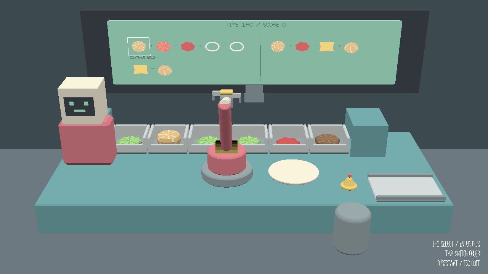

# Midnight Burger Bot

Current release verification and platform limits: [RELEASE_CHECK.md](RELEASE_CHECK.md).

Completed burgers now transfer as a whole stack onto the right-hand tray, ride out to the right, and leave an empty tray to return before replenishment and the next order. The clock continues; timeout freezes serving and R restores the tray. Narrow windows preserve the horizontal play area. Individual order titles and point labels are no longer shown.

Author: Yuchen Zhou

Design: Build burgers by driving a three-joint robot arm between six ingredient bins and a central assembly plate. Ingredient order matters: correct layers complete an order, while a wrong layer scraps the current stack.

Screen Shot:

How To Play:

The Step 5 build uses a fixed camera. Press **1–6** to select a bin position (its ingredient changes at runtime), **Enter** to pick, **R** to restart with a fresh order, and **Escape** to quit. No mouse is required. The wider wall board shows ingredient icons separated by plus signs, read left to right, then onto the second row. The next ingredient has a border and completed ingredients have check marks. There are no bin numbers, selection outlines, or ingredient-name overlays; slots run left to right. Selecting a slot moves the arm above it; once it stops, Enter lowers the gripper to pick. Input is locked during movement, while R and Escape remain available.

Orders contain 3–10 layers and may repeat fillings. The arm descends, closes its fingers, lifts and carries the ingredient to the plate, then releases it at the current stack height. After feedback, bins slide left through the picked slot and prepared supplies enter from the right; the next arrangement commits only when sliding finishes. A wrong pick clears the stack and restarts the same recipe; completing an order starts a new one. Each session lasts 180 seconds, including animation time. Completing an order awards twice its layer count in points when its last layer is released; a wrong release costs 5 seconds. At zero, GameOver freezes gameplay and the board shows the final score. R starts a fresh 180-second session. Conveyor endpoints have fixed tunnel housings made from the existing counter mesh. Clipping is recessed inside the housings; all six resting slots remain outside them. The arm base and discard bin are positioned at runtime within the arm's reach.

Build with `node Maekfile.js -q`. Run logic tests with `node Maekfile.js -q :test-logic`. To check the scene integration, build `node Maekfile.js -q dist/play-mode-test`, then run `./dist/play-mode-test objs/step5` (requires an OpenGL-capable desktop session; Windows executable has an `.exe` suffix).

Asset Pipeline:

The editable source is `scenes/burger.blend`. From `scenes/`, running `make` invokes the project's original Blender exporters to generate `dist/burger.pnct` for mesh data and `dist/burger.scene` for transforms, hierarchy, mesh instances, and the camera. Run `python3 scenes/validate-burger.py` from the repository root to check names, colors, hierarchy, work-envelope distances, ingredient alignment, triangle budget, camera count, and chunk structure.

The generated runtime assets are checked into `dist/`, so building or running the game does not require Blender. All Burger Bot geometry and vertex colors were created for this project.

This game was built with [NEST](NEST.md).

See [GAMEPLAY_WALKTHROUGH.md](GAMEPLAY_WALKTHROUGH.md) for the state machine, function responsibilities and complete correct/wrong-pick examples.

Order icons: ten transparent 192×192 PNGs in `dist/icons` are rendered from the existing ingredient models and loaded once at startup. Regenerate with `make -C scenes icons` (Blender required only for regeneration). This target does not save the Blender scene or export mesh/scene files. Include `dist/icons` when distributing the game. Board layout changes are runtime transforms; customer portraits remain deferred.

Two-order selection: the board shows the selected order on the left and a waiting order on the right, each with its potential points. Press **Tab** before the first confirmed grab to swap them; switching clears any hovered selection but does not change bin contents or reset the timer. The first grab locks the current order, including wrong-pick retries. After completion and conveyor advance, the waiting order becomes active and a new waiting order is generated. Only one burger is assembled at a time. Movement and GameOver block switching; R resets both orders. No sound has been added.
